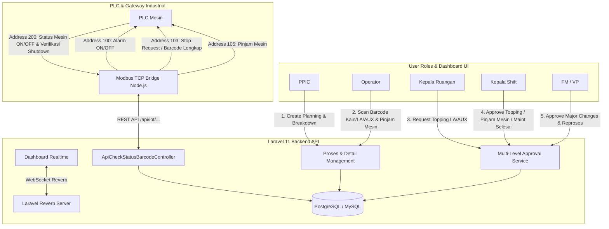

# 🏭 System Dyeing DPF 3 — Machine Monitoring & Production Management System

> Sistem monitoring mesin celup (*dyeing*), manajemen antrean produksi, validasi barcode bertingkat (*Kain, Dye Stuff, AUX, Topping*), alur multi-level approval (*FM, VP, Kepala Shift*), serta integrasi realtime IoT & Modbus TCP ke PLC Industrial.

---

## 📑 Daftar Isi
- [Tentang Proyek](#-tentang-proyek)
- [Tech Stack](#-tech-stack)
- [Arsitektur Sistem & Alur Bisnis](#-arsitektur-sistem--alur-bisnis)
  - [1. Alur Perencanaan & Input Proses Produksi](#1-alur-perencanaan--input-proses-produksi)
  - [2. Alur Scanning & Validasi Barcode (Kain, LA, AUX)](#2-alur-scanning--validasi-barcode-kain-la-aux)
  - [3. Alur Permintaan & Approval Topping (Grace Period 30 Menit)](#3-alur-permintaan--approval-topping-grace-period-30-menit)
  - [4. Alur Pinjam Mesin & Approval Kepala Shift](#4-alur-pinjam-mesin--approval-kepala-shift)
  - [5. Alur Multi-Level Approval (FM & VP)](#5-alur-multi-level-approval-fm--vp)
  - [6. Alur Force End, Selesai Maintenance & Verifikasi Shutdown (Address 103 & 200)](#6-alur-force-end-selesai-maintenance--verifikasi-shutdown-address-103--200)
  - [7. Alur Integrasi IoT, Modbus TCP & PLC Industrial](#7-alur-integrasi-iot-modbus-tcp--plc-industrial)
  - [8. Audit Trail & Activity Log](#8-audit-trail--activity-log)
- [Struktur Direktori](#-struktur-direktori)
- [Changelog & Versioning](#-changelog--versioning)
- [Instalasi & Menjalankan Proyek](#-instalasi--menjalankan-proyek)
  - [Menjalankan di Local Development](#menjalankan-di-local-development)
  - [Menjalankan dengan Docker Production](#menjalankan-dengan-docker-production)
- [Konfigurasi Environment](#-konfigurasi-environment)

---

## 📌 Tentang Proyek

**System Dyeing DPF 3** dirancang untuk mengotomatisasi, memantau, dan mengontrol seluruh alur kerja operasional departemen *Dyeing* (Pewarnaan Tekstil) secara *end-to-end* dan *real-time*.

### 🎯 Fitur Utama
1. **Realtime Dashboard Monitoring**: Visualisasi status mesin (ON/OFF), kartu proses interaktif (*Single OP & Multiple OP*), indikator lampu alarm, dan *countdown cycle time*.
2. **Strict Barcode Workflow**: Validasi ketat barcode Kain (G/F), Dye Stuff (LA), AUX, dan obat Topping sebelum dan selama proses berjalan.
3. **Smart IoT Alarm System**:
   - **Latch Alarm**: Alarm berbunyi terus-menerus jika proses berjalan tanpa barcode kain lengkap.
   - **Breakdown Schedule Alarm**: Alarm berbunyi otomatis jika input Dye Stuff / AUX terlambat dari jadwal breakdown PPIC, dan padam saat di-scan.
   - **Topping Grace Period (30 Menit)**: Memberikan waktu 30 menit setelah approval Kepala Shift sebelum alarm berbunyi.
4. **Modbus TCP & PLC Integration**: Komunikasi 2 arah dengan PLC mesin melalui gateway RS485/Modbus TCP (Address 100, 103, 105, 200).
   - **Shutdown Handshake**: Force End dan Selesai Maintenance mengirim sinyal 103 = 1 ke PLC dan menunggu verifikasi mesin mati (Address 200 = 0) sebelum proses resmi selesai dan antrian berikutnya berjalan.
   - **Pembatalan Selesai**: Fleksibilitas membatalkan permohonan selesai sebelum mesin mati yang secara instan me-reset sinyal 103 kembali ke 0.
5. **Multi-Level Role & Approval System**:
   - **Factory Manager (FM)**: Approval Edit Cycle Time, Delete, Move Machine, Swap Queue, Reproses Tahap 1, Pause/Resume.
   - **Vice President (VP)**: Approval Reproses Tahap 2.
   - **Kepala Shift (Kashift)**: Approval Topping LA/AUX, Approval Pinjam Mesin, Force End, Selesai Manual Maintenance, Batal Selesai.
   - **Kepala Ruangan (Karu)**: Pengajuan Topping LA/AUX, Selesai Maintenance, Batal Selesai Maintenance.
   - **SPV Listrik**: Monitoring real-time status online/offline koneksi IoT per mesin pada tabel mesin.
   - **Operator & PPIC**: Input order, scan barcode, pengajuan pinjam mesin.
6. **Audit Trail**: Pencatatan riwayat setiap aksi, perubahan data (before/after), IP address, dan user role.

---

## 🛠 Tech Stack

### Backend & Core
- **Framework**: Laravel 11.x
- **Runtime**: PHP 8.4 (FPM)
- **Database**:
  - **Local Development**: MySQL 8.x / MariaDB
  - **Production**: PostgreSQL 16
  - **Data Integration**: Microsoft SQL Server 2014 (via `pdo_sqlsrv` & `msodbcsql17`)
- **Cache & Queue**: Redis (Alpine)

### Frontend & Realtime
- **Template Engine**: Laravel Blade
- **CSS / UI**: Bootstrap 5, Custom CSS Tokens, Glassmorphism, FontAwesome 6
- **JavaScript**: Vanilla JS (ES6+), SortableJS (Drag & Drop Antrean), Select2, SweetAlert2
- **Realtime WebSocket**: Laravel Reverb (Pusher Protocol) & Laravel Echo

### IoT & Hardware Bridge
- **Protocol**: Modbus TCP / RTU over TCP (Port 502 / 8899)
- **Gateway**: USR-W610 RS485 to WiFi/Ethernet Converter
- **Modbus Client**: Node.js (`modbus-serial`, `axios`)
- **Microcontroller**: ESP32 / Arduino Industrial PLC

### DevOps & Deployment
- **Containerization**: Docker & Docker Compose
- **Web Server**: Nginx (Alpine) + Reverse Proxy Cloudflare SSL
- **Process Manager**: PHP-FPM, Supervisor / Docker Entrypoint

---

## 🏗 Arsitektur Sistem & Alur Bisnis



---

### 1. Alur Perencanaan & Input Proses Produksi
1. **PPIC** membuat order proses baru pada mesin target (Jenis: `Produksi`, `Reproses`, atau `Maintenance`).
2. Mode proses ditentukan: `Greige` (Barcode G) atau `Finish` (Barcode F).
3. **Single OP / Multiple OP**: Satu kartu proses dapat menampung beberapa No OP / No Partai dengan jumlah roll masing-masing.
4. **Breakdown Jam Input**: PPIC mengatur kuantitas *Dye Stuff* (LA) dan *AUX* beserta breakdown target waktu input (*Cycle Time Breakdown* format `JJ:MM:DD`).

---

### 2. Alur Scanning & Validasi Barcode (Kain, LA, AUX)
1. **Barcode Kain (G / F)**:
   - Operator men-scan seluruh roll kain sebelum/saat proses berjalan.
   - **Aturan Latch Alarm**: Jika proses berjalan (`mulai !== null`) dalam kondisi barcode kain belum lengkap, sistem mengunci status **Alarm Latched**. Alarm akan terus berbunyi hingga proses selesai, meskipun operator melengkapi barcode di tengah proses.
2. **Barcode Dye Stuff (LA) & AUX**:
   - Jadwal breakdown jam input dipantau secara realtime oleh sistem IoT.
   - Jika waktu breakdown terlewati dan barcode belum di-scan, alarm IoT berbunyi.
   - Saat barcode valid di-scan, alarm otomatis **PADAM (OFF)**.

---

### 3. Alur Permintaan & Approval Topping (Grace Period 30 Menit)
1. Jika warna/kain memerlukan penambahan obat saat proses berjalan, **Kepala Ruangan (Karu)** mengajukan permohonan **Topping LA** atau **Topping AUX**.
2. **Kepala Shift (Kashift)** memeriksa dan menyetujui (**Approve**) permohonan tersebut.
3. **Grace Period 30 Menit**:
   - Dihitung sejak waktu approval Kashift (`updated_at`), alarm **TIDAK AKAN MENYALA** selama $\le$ 30 menit untuk memberi waktu pengambilan obat dan penimbangan.
   - Jika setelah 30 menit barcode topping belum di-scan, **Alarm IoT menyala**.
   - Segera setelah barcode topping di-scan lengkap, **Alarm langsung padam**.

---

### 4. Alur Pinjam Mesin & Approval Kepala Shift
1. **Operator**, **PPIC**, atau **Super Admin** dapat mengajukan **Pinjam Mesin** untuk proses `Produksi`, `Reproses Greige`, dan `Reproses Finish` yang sedang berjalan atau berada pada antrian berikutnya (urutan ke-1).
2. Pemohon memilih Mesin Tujuan dan mengisikan alasan peminjaman.
3. Status proses masuk ke daftar **Approval Kepala Shift**.
4. Saat **Kepala Shift Approve**:
   - Proses otomatis dipindahkan ke mesin tujuan.
   - Antrian mesin asal dan mesin tujuan diurutkan ulang (*re-order*).
   - Sinyal **Address 105** bernilai `1` aktif ke Modbus TCP.

---

### 5. Alur Multi-Level Approval (FM & VP)
1. **Approval Factory Manager (FM)**:
   - Perubahan Cycle Time (`edit_cycle_time`).
   - Pembatalan/Penghapusan Proses (`delete_proses`).
   - Pemindahan Mesin Planning (`move_machine`).
   - Tukar Posisi Antrean (`swap_position`).
   - Pause & Resume Proses (`pause_proses`, `resume_proses`).
   - Reproses Tahap 1 (`create_reprocess` / `create_aux_reprocess`).
2. **Approval Vice President (VP)**:
   - Verifikasi tahap akhir Reproses setelah disetujui FM.

---

### 6. Alur Force End, Selesai Maintenance & Verifikasi Shutdown (Address 103 & 200)

#### A. Alur Selesai Paksa (Force End Produksi / Reproses)
1. **Hak Akses**: Hanya **Super Admin** dan **Kepala Shift**.
2. **Kondisi Mesin Hidup (ON)**:
   - Saat tombol **Selesai Paksa (Force End)** ditekan dan dikonfirmasi, sistem **tidak langsung menyelesaikan** proses ke history dan antrian berikutnya **tidak langsung dijalankan**.
   - Sistem menetapkan `stop_requested_at = now()`, `stop_request_type = 'force_finish'`, dan mengirim sinyal **Address 103 = 1** ke PLC.
   - Pada kartu proses di dashboard muncul banner animasi oranye: `Menunggu Mesin Mati (Sinyal 103 ON)`.
   - Sistem menunggu operator lapangan mematikan mesin (**Address 200 = 0**).
   - Segera setelah Address 200 bernilai `0` (mesin mati):
     - Proses resmi diselesaikan (`selesai = now()`), durasi actual dihitung, dan dipindahkan ke riwayat (*history*).
     - Sinyal 103 otomatis di-reset kembali ke `0`.
     - Ketika mesin nantinya dinyalakan kembali, proses antrian berikutnya akan otomatis dijalankan.
3. **Kondisi Mesin Mati (OFF)**: Jika mesin memang sudah dalam keadaan OFF saat tombol ditekan, proses langsung diselesaikan secara instan.

#### B. Alur Selesai Maintenance
1. **Hak Akses**: **Super Admin**, **Kepala Shift**, dan **Kepala Ruangan (KARU)**.
2. Informasi GDA, mode, jenis OP, qty dye stuff/aux disembunyikan secara otomatis pada proses maintenance.
3. **Mekanisme Verifikasi Shutdown**:
   - Jika mesin sedang ON saat tombol **Selesai Maintenance** ditekan, sinyal **Address 103 = 1** dikirim ke PLC dan proses berstatus menunggu mesin mati (`stop_requested_at = now()`, `stop_request_type = 'maintenance_finish'`).
   - Proses resmi selesai dan antrian berikutnya baru diizinkan berjalan setelah register **Address 200 = 0** (mesin fisik mati).

#### C. Fitur Pembatalan Selesai ("Batal Force End / Batal Selesai")
1. **Hak Akses**: **Super Admin**, **Kepala Shift**, dan **Kepala Ruangan**.
2. **Operasional**:
   - Jika terjadi pembatalan atau salah klik sebelum mesin mati, user dapat membuka modal detail proses.
   - Tersedia tombol **"Batal Force End"** atau **"Batal Selesai"** beserta kotak notifikasi status menunggu mesin mati.
   - Saat tombol pembatalan diklik dan dikonfirmasi:
     - Field `stop_requested_at`, `stop_requested_by`, dan `stop_request_type` di-reset menjadi `null`.
     - Cache alarm dibersihkan sehingga sinyal **Address 103 langsung kembali ke 0**.
     - Status kartu proses di dashboard kembali menjadi proses normal berjalan via WebSocket real-time.

---

### 7. Alur Integrasi IoT, Modbus TCP & PLC Industrial

#### Tabel Pemetaan Register Modbus:
| Modbus Address | Arah | Nilai | Definisi & Fungsi |
| :--- | :--- | :---: | :--- |
| **Address 200** | Read dari PLC $\rightarrow$ POST ke API | `0` / `1` | **Status Mesin Fisik ON/OFF** dari Relay/Pompa Air PLC.<br>• `0`: Mesin Mati (memicu eksekusi penyelesaian proses jika sedang berstatus menunggu stop).<br>• `1`: Mesin Beroperasi. |
| **Address 100** | GET dari API $\rightarrow$ Write ke PLC | `0` / `1` | **Status Alarm IoT** (1 = Bunyi, 0 = Padam). |
| **Address 103** | GET dari API $\rightarrow$ Write ke PLC | `0` / `1` | **Stop Request Aktif (Force End / Selesai Maintenance) ATAU Seluruh Barcode Lengkap 100%**.<br>• Bernilai `1` saat barcode lengkap atau sistem sedang menunggu mesin mati.<br>• Otomatis kembali ke `0` saat stop request dibatalkan atau mesin sudah mati. |
| **Address 105** | GET dari API $\rightarrow$ Write ke PLC | `0` / `1` | **Status / Flag Pinjam Mesin** Aktif. |

---

### 8. Audit Trail & Activity Log
- Seluruh mutasi data sensitif (tambah proses, hapus proses, approve/reject, scan barcode, transfer mesin, dan login) dicatat ke tabel `activity_logs`.
- Menyimpan snapshot JSON `before_update` dan `after_update`, User ID, Role, IP Address, dan Timestamp.

---

## 📂 Struktur Direktori

```text
system_dyeing/dyeing/
├── app/
│   ├── Events/                     # WebSocket Broadcast Events (ProsesStatusUpdated, MesinUpdated, dll)
│   ├── Http/
│   │   ├── Controllers/            # Controller Logika Bisnis & API
│   │   │   ├── ApiCheckStatusBarcodeController.php  # API IoT Modbus, Alarm Logic, Signals 100/103/105
│   │   │   ├── ApprovalController.php               # Workflow Approval FM, VP, & Kepala Shift
│   │   │   ├── DashboardController.php              # Dashboard Utama & Realtime Status Data
│   │   │   ├── ProsesController.php                 # CRUD Proses, Barcode Scanner, Pinjam Mesin, Maintenance
│   │   │   └── ...
│   │   └── Middleware/             # RolePermissionMiddleware, VerifyCsrfToken, dll
│   ├── Models/                     # Eloquent Models (Proses, DetailProses, Approval, Barcode, Mesin, User)
│   ├── Observers/                  # Model Observers (Realtime WebSocket Broadcast Triggers)
│   └── Services/                   # Business Services (ProsesStatusService, MesinCacheService)
├── bootstrap/                      # Application Bootstrap & Middleware Configuration
├── config/                         # Configuration Files (database, reverb, cache, queue)
├── database/
│   ├── migrations/                 # Database Migrations (MySQL & PostgreSQL Compatible)
│   └── seeders/                    # Master Data & User Role Seeders
├── docker/                         # Docker Configurations (Nginx, PHP-FPM, Entrypoints)
├── public/                         # Public Assets (CSS, JS, Images, Icons)
├── resources/
│   └── views/                      # Blade Templates
│       ├── approval/               # Tampilan Approval FM, VP, & Kepala Shift
│       ├── partials/dashboard/     # Reusable Status Cards & Badges
│       └── dashboard.blade.php     # Realtime Dashboard Monitoring Mesin
├── routes/
│   ├── api.php                     # IoT & External API Endpoints (/api/iot/...)
│   └── web.php                     # Web Routes & Role Middleware Grouping
├── compose.prod.yaml               # Docker Compose Production (Nginx, PHP-FPM, Postgres, Redis, Reverb)
└── README.md                       # Dokumentasi Proyek
```

---

## 📝 Changelog & Versioning

### Versi 2.5.0 (September 2026)
- 🛑 **Handshake Sinyal 103 & 200 (Force End & Selesai Maintenance)**:
  - Force End (Produksi/Reproses) dan Selesai Maintenance mengirim sinyal 103 = 1 ke PLC dan menunggu mesin mati / register 200 = 0 sebagai verifikasi fisik unload / shutdown sebelum proses dipindahkan ke riwayat dan antrian berikutnya dijalankan.
- ↩️ **Fitur Batal Force End & Batal Selesai**:
  - Tombol pembatalan permohonan selesai sebelum mesin mati pada modal detail proses. Secara instan me-reset sinyal 103 kembali ke 0 dan mengembalikan status proses menjadi normal berjalan.
- ⚡ **Hak Akses SPV Listrik pada Tabel Mesin**:
  - Role `spv_listrik` kini dapat memantau status indikator "Sinyal IoT" (Terhubung / Terputus) secara langsung pada halaman `/mesin`.
- 🔄 **Realtime WebSocket Synchronization**:
  - Banner oranye status menunggu mesin mati dan tombol pembatalan tersinkronisasi secara otomatis antar browser tanpa reload.

### Versi 2.4.0 (Agustus 2026)
- ✨ **Fitur Pinjam Mesin**: Pengajuan pinjam mesin untuk proses berjalan / antrian ke-1 dengan Approval Kepala Shift.
- ⚡ **Integrasi Modbus TCP Address 103 & 105**:
  - Address 103: Sinyal 1 saat Maintenance Selesai Manual atau Seluruh Barcode Lengkap (Single/Multiple OP).
  - Address 105: Sinyal 1 saat status Pinjam Mesin aktif/approved.
- ⏱ **Smart Topping Alarm**: Spare waktu 30 menit (*grace period*) sebelum alarm berbunyi setelah approval Kashift.
- 🛠 **Maintenance End Process**: Tombol Selesai Manual khusus Super Admin & Kepala Shift.
- 🎨 **Layout UI Clean Up**: Penyembunyian field GDA & barcode opsional pada proses Maintenance.
- 🐛 **Bugfix Docker 500**: Perbaikan parsing directive `@json` pada Blade compiler.

### Versi 2.3.0 (Juli 2026)
- ✨ Multi-Level Approval Reproses (Tahap 1: FM, Tahap 2: VP).
- ⚡ Realtime WebSocket menggunakan Laravel Reverb.
- 🔒 Latch Alarm Barcode Kain untuk mencegah kelalaian operator.

---

## 🚀 Instalasi & Menjalankan Proyek

### Menjalankan di Local Development

1. **Clone Repositori**:
   ```bash
   git clone https://github.com/TanNicholas80/dyeing.git
   cd dyeing
   ```

2. **Install Dependencies**:
   ```bash
   composer install
   npm install
   ```

3. **Setup Environment**:
   ```bash
   cp .env.example .env
   php artisan key:generate
   ```

4. **Migrasi Database & Seeder**:
   ```bash
   php artisan migrate --seed
   ```

5. **Jalankan Server Lokal**:
   ```bash
   # Terminal 1: Laravel Server
   php artisan serve

   # Terminal 2: Vite / Asset Watcher
   npm run dev

   # Terminal 3: WebSocket Reverb Server
   php artisan reverb:start

   # Terminal 4: Queue Worker
   php artisan queue:work
   ```

---

### Menjalankan dengan Docker Production

1. **Pastikan Docker & Docker Compose Terinstall**:
   ```bash
   docker --version
   docker compose version
   ```

2. **Konfigurasi `.env` Production**:
   Sesuaikan konfigurasi database PostgreSQL, Redis, dan Reverb.

3. **Build & Jalankan Container**:
   ```bash
   docker compose -f compose.prod.yaml up -d --build
   ```

4. **Verifikasi Service yang Berjalan**:
   ```bash
   docker compose -f compose.prod.yaml ps
   ```
   *Services*: `web (Nginx)`, `php-fpm`, `postgres`, `redis`, `reverb`, `queue`.

---

## ⚙ Konfigurasi Environment

Contoh konfigurasi `.env` penting:

```dotenv
APP_NAME="Dyeing System DPF 3"
APP_ENV=production
APP_KEY=base64:...
APP_DEBUG=false
APP_URL=https://dpf3dunia.com

# Database Connection (PostgreSQL Production)
DB_CONNECTION=pgsql
DB_HOST=postgres
DB_PORT=5432
DB_DATABASE=dpf3dunia
DB_USERNAME=laravel
DB_PASSWORD=your_secure_password

# Redis Configuration
REDIS_CLIENT=phpredis
REDIS_HOST=redis
REDIS_PASSWORD=null
REDIS_PORT=6379

# Broadcast & Realtime Reverb
BROADCAST_CONNECTION=reverb
REVERB_APP_ID=849201
REVERB_APP_KEY=dpf3reverbkey
REVERB_APP_SECRET=dpf3reverbsecret
REVERB_HOST="ws.dpf3dunia.com"
REVERB_PORT=443
REVERB_SCHEME=https

# IoT Security Token
IOT_DEVICE_TOKEN=7b89d4e1f2a0c3b5
```

---

## 👥 Pengembang & Hak Cipta
* **Pengembang**: Nicholas Tan ([@TanNicholas80](https://github.com/TanNicholas80))
* **Departemen**: Dyeing & IT Automation — DPF 3
* **Lisensi**: Proprietary / Hak Cipta Dilindungi.
